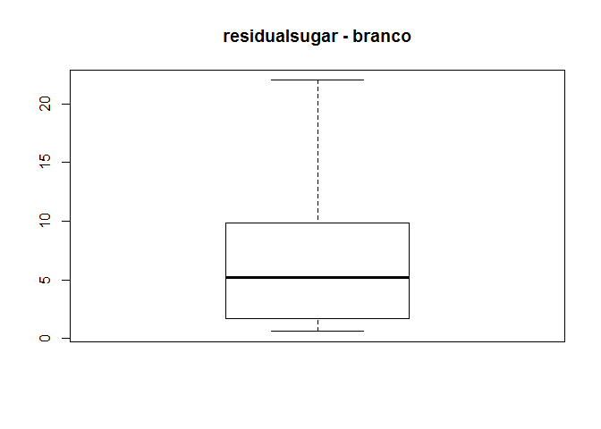

Vinhos
================
Gabriel Dias
2018-09-02

Importação de bibliotecas e configurações
-----------------------------------------

``` r
library("psych")
library("plotly")
library("gmodels")
library("corrgram")
library("gmodels")
library("psych")
library("corrgram")
# mostrar até 2 casas decimais
options("scipen" = 2)

#leitura csv
Vinhos <- read.csv2("D:/FIAP/5 - conceitos estatisticos/Solution/BaseWine_Red_e_White2018.csv", row.names=1)
```

------------------------------------------------------------------------

Análise exploratória de dados
-----------------------------

------------------------------------------------------------------------

Para começar a exploração dos dados da base de vinhos será executado comandos que que exibem as variáveis existentes dentro do dataset, seus respectivos tipos e os primeiros registros:

``` r
#mostrar as variáveis
str(Vinhos)
```

    ## 'data.frame':    6497 obs. of  13 variables:
    ##  $ fixedacidity      : num  6.6 6.7 10.6 5.4 6.7 6.8 6.6 7.2 5.1 6.2 ...
    ##  $ volatileacidity   : num  0.24 0.34 0.31 0.18 0.3 0.5 0.61 0.66 0.26 0.22 ...
    ##  $ citricacid        : num  0.35 0.43 0.49 0.24 0.44 0.11 0 0.33 0.33 0.2 ...
    ##  $ residualsugar     : num  7.7 1.6 2.2 4.8 18.8 ...
    ##  $ chlorides         : num  0.031 0.041 0.063 0.041 0.057 0.075 0.069 0.068 0.027 0.035 ...
    ##  $ freesulfurdioxide : num  36 29 18 30 65 16 4 34 46 58 ...
    ##  $ totalsulfurdioxide: num  135 114 40 113 224 49 8 102 113 184 ...
    ##  $ density           : num  0.994 0.99 0.998 0.994 1 ...
    ##  $ pH                : num  3.19 3.23 3.14 3.42 3.11 3.36 3.33 3.27 3.35 3.11 ...
    ##  $ sulphates         : num  0.37 0.44 0.51 0.4 0.53 0.79 0.37 0.78 0.43 0.53 ...
    ##  $ alcohol           : num  10.5 12.6 9.8 9.4 9.1 9.5 10.4 12.8 11.4 9 ...
    ##  $ quality           : int  5 6 6 6 5 5 4 6 7 6 ...
    ##  $ Vinho             : Factor w/ 2 levels "RED","WHITE": 2 2 1 2 2 1 1 1 2 2 ...

``` r
#mostra as variáveis
names(Vinhos)
```

    ##  [1] "fixedacidity"       "volatileacidity"    "citricacid"        
    ##  [4] "residualsugar"      "chlorides"          "freesulfurdioxide" 
    ##  [7] "totalsulfurdioxide" "density"            "pH"                
    ## [10] "sulphates"          "alcohol"            "quality"           
    ## [13] "Vinho"

Na amostra que temos vamos analisar a qualidade por tipo de vinho realizando o cálculo de distruibuição de frequeência absoluta:

``` r
# Frequência absoluta 
#os 2 comandos dao o mesmo resultado porque nao ha nulos no campo qualidade
#table(as.factor(Vinhos$quality), Vinhos$Vinho, useNA = "ifany")

table(as.factor(Vinhos$quality), Vinhos$Vinho)
```

    ##    
    ##      RED WHITE
    ##   3   10    20
    ##   4   53   163
    ##   5  681  1457
    ##   6  638  2198
    ##   7  199   880
    ##   8   18   175
    ##   9    0     5

``` r
#outra visualização, comparando distribuição dos dados por nota e tipo de vinho
CrossTable(as.factor(Vinhos$quality), Vinhos$Vinho) 
```

    ## 
    ##  
    ##    Cell Contents
    ## |-------------------------|
    ## |                       N |
    ## | Chi-square contribution |
    ## |           N / Row Total |
    ## |           N / Col Total |
    ## |         N / Table Total |
    ## |-------------------------|
    ## 
    ##  
    ## Total Observations in Table:  6497 
    ## 
    ##  
    ##                           | Vinhos$Vinho 
    ## as.factor(Vinhos$quality) |       RED |     WHITE | Row Total | 
    ## --------------------------|-----------|-----------|-----------|
    ##                         3 |        10 |        20 |        30 | 
    ##                           |     0.927 |     0.303 |           | 
    ##                           |     0.333 |     0.667 |     0.005 | 
    ##                           |     0.006 |     0.004 |           | 
    ##                           |     0.002 |     0.003 |           | 
    ## --------------------------|-----------|-----------|-----------|
    ##                         4 |        53 |       163 |       216 | 
    ##                           |     0.000 |     0.000 |           | 
    ##                           |     0.245 |     0.755 |     0.033 | 
    ##                           |     0.033 |     0.033 |           | 
    ##                           |     0.008 |     0.025 |           | 
    ## --------------------------|-----------|-----------|-----------|
    ##                         5 |       681 |      1457 |      2138 | 
    ##                           |    45.546 |    14.869 |           | 
    ##                           |     0.319 |     0.681 |     0.329 | 
    ##                           |     0.426 |     0.297 |           | 
    ##                           |     0.105 |     0.224 |           | 
    ## --------------------------|-----------|-----------|-----------|
    ##                         6 |       638 |      2198 |      2836 | 
    ##                           |     5.154 |     1.683 |           | 
    ##                           |     0.225 |     0.775 |     0.437 | 
    ##                           |     0.399 |     0.449 |           | 
    ##                           |     0.098 |     0.338 |           | 
    ## --------------------------|-----------|-----------|-----------|
    ##                         7 |       199 |       880 |      1079 | 
    ##                           |    16.681 |     5.446 |           | 
    ##                           |     0.184 |     0.816 |     0.166 | 
    ##                           |     0.124 |     0.180 |           | 
    ##                           |     0.031 |     0.135 |           | 
    ## --------------------------|-----------|-----------|-----------|
    ##                         8 |        18 |       175 |       193 | 
    ##                           |    18.321 |     5.981 |           | 
    ##                           |     0.093 |     0.907 |     0.030 | 
    ##                           |     0.011 |     0.036 |           | 
    ##                           |     0.003 |     0.027 |           | 
    ## --------------------------|-----------|-----------|-----------|
    ##                         9 |         0 |         5 |         5 | 
    ##                           |     1.231 |     0.402 |           | 
    ##                           |     0.000 |     1.000 |     0.001 | 
    ##                           |     0.000 |     0.001 |           | 
    ##                           |     0.000 |     0.001 |           | 
    ## --------------------------|-----------|-----------|-----------|
    ##              Column Total |      1599 |      4898 |      6497 | 
    ##                           |     0.246 |     0.754 |           | 
    ## --------------------------|-----------|-----------|-----------|
    ## 
    ## 

Temos 4898 observações de vinho branco e 1599 de vinho tinto. Por enquanto pode-se observar que da amostra o vinho tinto nunca teve nota 9 e que a maior parte das notas atribuidas foram 5 e 6 (para ambos os vinhos). Abaixo vamos analisar um sumário de cada variável do dataset (min, max, mediana, média, 1<sup>*o*</sup> e 3<sup>*o*</sup> quartis)

    ##   fixedacidity    volatileacidity    citricacid     residualsugar  
    ##  Min.   : 3.800   Min.   :0.0800   Min.   :0.0000   Min.   : 0.60  
    ##  1st Qu.: 6.400   1st Qu.:0.2300   1st Qu.:0.2500   1st Qu.: 1.80  
    ##  Median : 7.000   Median :0.2900   Median :0.3100   Median : 3.00  
    ##  Mean   : 7.215   Mean   :0.3397   Mean   :0.3186   Mean   : 5.44  
    ##  3rd Qu.: 7.700   3rd Qu.:0.4000   3rd Qu.:0.3900   3rd Qu.: 8.10  
    ##  Max.   :15.900   Max.   :1.5800   Max.   :1.6600   Max.   :45.80  
    ##    chlorides       freesulfurdioxide totalsulfurdioxide    density      
    ##  Min.   :0.00900   Min.   :  1.00    Min.   :  6.0      Min.   :0.9871  
    ##  1st Qu.:0.03800   1st Qu.: 17.00    1st Qu.: 77.0      1st Qu.:0.9923  
    ##  Median :0.04700   Median : 29.00    Median :118.0      Median :0.9949  
    ##  Mean   :0.05603   Mean   : 30.53    Mean   :115.7      Mean   :0.9947  
    ##  3rd Qu.:0.06500   3rd Qu.: 41.00    3rd Qu.:156.0      3rd Qu.:0.9970  
    ##  Max.   :0.61100   Max.   :289.00    Max.   :440.0      Max.   :1.0140  
    ##        pH          sulphates         alcohol           quality     
    ##  Min.   :2.720   Min.   :0.2200   Min.   : 0.9567   Min.   :3.000  
    ##  1st Qu.:3.110   1st Qu.:0.4300   1st Qu.: 9.5000   1st Qu.:5.000  
    ##  Median :3.210   Median :0.5100   Median :10.3000   Median :6.000  
    ##  Mean   :3.219   Mean   :0.5313   Mean   :10.4862   Mean   :5.818  
    ##  3rd Qu.:3.320   3rd Qu.:0.6000   3rd Qu.:11.3000   3rd Qu.:6.000  
    ##  Max.   :4.010   Max.   :2.0000   Max.   :14.9000   Max.   :9.000  
    ##    Vinho     
    ##  RED  :1599  
    ##  WHITE:4898  
    ##              
    ##              
    ##              
    ## 


Embora nos dê uma boa visão de distribuição dos dados, os histogramas acima podem dificultar a análise em cima de vinhos tinto e branco individualmente. O problema da sumarização acima é que os cálculos são feitos na base inteira, podendo mascarar outliers, por exemplo. Ou então a média ficar muito abaixo/acima do esperado por vinho (vimos anteriormente que a proporção de dados vinho tinto/branco não é equilibrada, é 3 para 1 praticamente).

Com o uso da função agreggate essa divisão por tipo de vinho será possível.

``` r
#mediana
aggregate(Vinhos[,-13], #remover o tipo de vinho, qualitativo
          by = list(Vinhos$Vinho),
          FUN = median)
```

    ##   Group.1 fixedacidity volatileacidity citricacid residualsugar chlorides
    ## 1     RED          7.9            0.52       0.26           2.2     0.079
    ## 2   WHITE          6.8            0.26       0.32           5.2     0.043
    ##   freesulfurdioxide totalsulfurdioxide density   pH sulphates alcohol
    ## 1                14                 38 0.99675 3.31      0.62    10.2
    ## 2                34                134 0.99374 3.18      0.47    10.4
    ##   quality
    ## 1       6
    ## 2       6

Pela mediana, é possível perceber diferenças principalmente nas variáveis que estão associados ao dióxido de enxofre, principalmente a *totalsulfurdioxide*. O vinho tinto deveria ter menos açúcar que o branco também, pode-se fazer uma análise com essas variáveis para ver a distribuição dos dados

``` r
boxplot(totalsulfurdioxide ~ Vinho, main='totalsulfurdioxide')
```


``` r
boxplot(freesulfurdioxide ~ Vinho, main='freesulfurdioxide')
```


``` r
boxplot(residualsugar ~ Vinho, main='residualsugar')
```

 \*\*\*\*\* \#\# Remoção de outliers \*\*\*\*\* Vamos separar em 2 datasets para remoção dos outliers.

``` r
branco <- subset(Vinhos, Vinho=="WHITE", select=c(quality,fixedacidity,volatileacidity,citricacid,residualsugar,
                                                 chlorides,freesulfurdioxide,totalsulfurdioxide,density,pH,
                                                 sulphates,alcohol))
tinto <- subset(Vinhos, Vinho=="RED", select=c(quality,fixedacidity,volatileacidity,citricacid,residualsugar,
                                                 chlorides,freesulfurdioxide,totalsulfurdioxide,density,pH,
                                                 sulphates,alcohol))

summary(branco)
```

    ##     quality       fixedacidity    volatileacidity    citricacid    
    ##  Min.   :3.000   Min.   : 3.800   Min.   :0.0800   Min.   :0.0000  
    ##  1st Qu.:5.000   1st Qu.: 6.300   1st Qu.:0.2100   1st Qu.:0.2700  
    ##  Median :6.000   Median : 6.800   Median :0.2600   Median :0.3200  
    ##  Mean   :5.878   Mean   : 6.855   Mean   :0.2782   Mean   :0.3342  
    ##  3rd Qu.:6.000   3rd Qu.: 7.300   3rd Qu.:0.3200   3rd Qu.:0.3900  
    ##  Max.   :9.000   Max.   :14.200   Max.   :1.1000   Max.   :1.6600  
    ##  residualsugar      chlorides       freesulfurdioxide totalsulfurdioxide
    ##  Min.   : 0.600   Min.   :0.00900   Min.   :  2.00    Min.   :  9.0     
    ##  1st Qu.: 1.700   1st Qu.:0.03600   1st Qu.: 23.00    1st Qu.:108.0     
    ##  Median : 5.200   Median :0.04300   Median : 34.00    Median :134.0     
    ##  Mean   : 6.387   Mean   :0.04577   Mean   : 35.31    Mean   :138.4     
    ##  3rd Qu.: 9.900   3rd Qu.:0.05000   3rd Qu.: 46.00    3rd Qu.:167.0     
    ##  Max.   :45.800   Max.   :0.34600   Max.   :289.00    Max.   :440.0     
    ##     density             pH          sulphates         alcohol     
    ##  Min.   :0.9871   Min.   :2.720   Min.   :0.2200   Min.   : 8.00  
    ##  1st Qu.:0.9917   1st Qu.:3.090   1st Qu.:0.4100   1st Qu.: 9.50  
    ##  Median :0.9937   Median :3.180   Median :0.4700   Median :10.40  
    ##  Mean   :0.9940   Mean   :3.188   Mean   :0.4898   Mean   :10.51  
    ##  3rd Qu.:0.9961   3rd Qu.:3.280   3rd Qu.:0.5500   3rd Qu.:11.40  
    ##  Max.   :1.0140   Max.   :3.820   Max.   :1.0800   Max.   :14.20

``` r
summary(tinto)
```

    ##     quality       fixedacidity   volatileacidity    citricacid   
    ##  Min.   :3.000   Min.   : 4.60   Min.   :0.1200   Min.   :0.000  
    ##  1st Qu.:5.000   1st Qu.: 7.10   1st Qu.:0.3900   1st Qu.:0.090  
    ##  Median :6.000   Median : 7.90   Median :0.5200   Median :0.260  
    ##  Mean   :5.636   Mean   : 8.32   Mean   :0.5278   Mean   :0.271  
    ##  3rd Qu.:6.000   3rd Qu.: 9.20   3rd Qu.:0.6400   3rd Qu.:0.420  
    ##  Max.   :8.000   Max.   :15.90   Max.   :1.5800   Max.   :1.000  
    ##  residualsugar      chlorides       freesulfurdioxide totalsulfurdioxide
    ##  Min.   : 0.900   Min.   :0.01200   Min.   : 1.00     Min.   :  6.00    
    ##  1st Qu.: 1.900   1st Qu.:0.07000   1st Qu.: 7.00     1st Qu.: 22.00    
    ##  Median : 2.200   Median :0.07900   Median :14.00     Median : 38.00    
    ##  Mean   : 2.539   Mean   :0.08747   Mean   :15.87     Mean   : 46.47    
    ##  3rd Qu.: 2.600   3rd Qu.:0.09000   3rd Qu.:21.00     3rd Qu.: 62.00    
    ##  Max.   :15.500   Max.   :0.61100   Max.   :72.00     Max.   :289.00    
    ##     density             pH          sulphates         alcohol       
    ##  Min.   :0.9901   Min.   :2.740   Min.   :0.3300   Min.   : 0.9567  
    ##  1st Qu.:0.9956   1st Qu.:3.210   1st Qu.:0.5500   1st Qu.: 9.5000  
    ##  Median :0.9968   Median :3.310   Median :0.6200   Median :10.2000  
    ##  Mean   :0.9967   Mean   :3.311   Mean   :0.6581   Mean   :10.4001  
    ##  3rd Qu.:0.9978   3rd Qu.:3.400   3rd Qu.:0.7300   3rd Qu.:11.1000  
    ##  Max.   :1.0037   Max.   :4.010   Max.   :2.0000   Max.   :14.9000

Com os dados separados por tipo de vinho, calcular diferença interquartílica e depois remover dos outliers.

``` r
#calculo da diferenca interquartilica, AIQ
#açucar
AIQ_residualsugar<-quantile(branco$residualsugar,.75,type=2)-quantile(branco$residualsugar,.25,type=2)
limsup_residualsugar= quantile(branco$residualsugar,.75,type=2)+1.5*AIQ_residualsugar
liminf_residualsugar= quantile(branco$residualsugar,.25,type=2)-1.5*AIQ_residualsugar
branco <- subset(branco, residualsugar >= liminf_residualsugar & residualsugar <= limsup_residualsugar)


AIQ_residualsugar<-quantile(tinto$residualsugar,.75,type=2)-quantile(tinto$residualsugar,.25,type=2)
limsup_residualsugar= quantile(tinto$residualsugar,.75,type=2)+1.5*AIQ_residualsugar
liminf_residualsugar= quantile(tinto$residualsugar,.25,type=2)-1.5*AIQ_residualsugar
tinto <- subset(tinto, residualsugar >= liminf_residualsugar & residualsugar <= limsup_residualsugar)

rm(AIQ_residualsugar)
rm(limsup_residualsugar)
rm(liminf_residualsugar)

par (mfrow=c(1,2))
attach(branco)
boxplot(residualsugar, main='residualsugar - branco')

attach(tinto)
boxplot(residualsugar, main='residualsugar - tinto')
```


