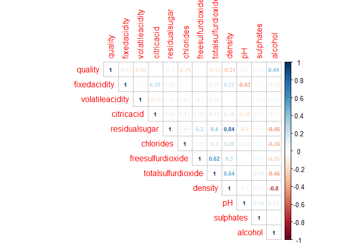
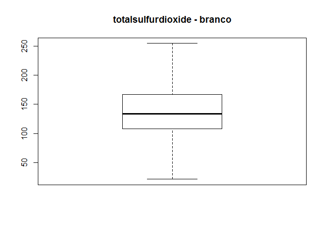
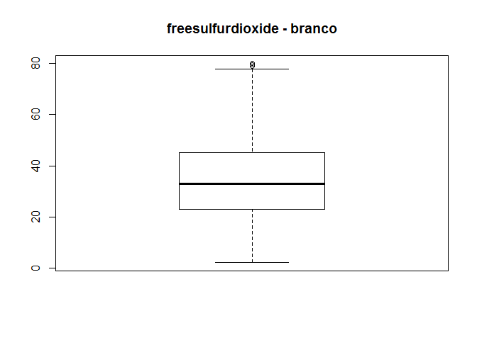
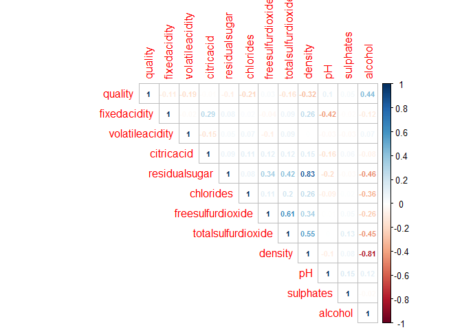
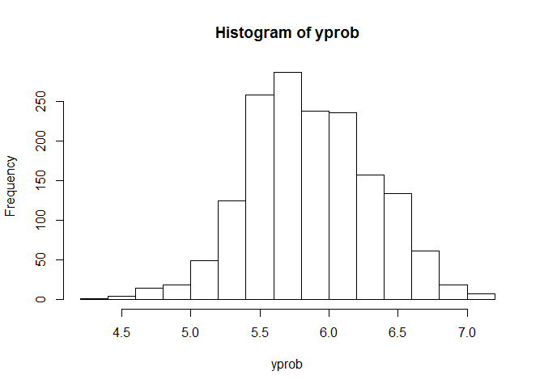
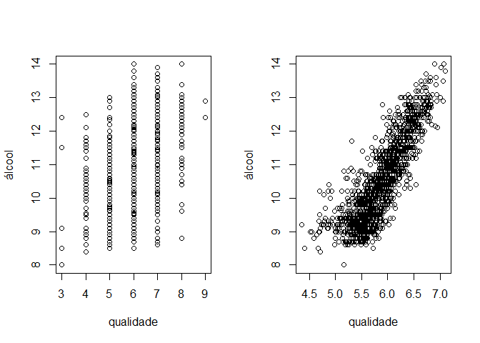

Vinhos
================
Gabriel Dias - RM330587, Guilherme Lahr - RM330351
2018-10-11

Importação de bibliotecas e configurações
-----------------------------------------

``` r
library("psych")
library("plotly")
library("gmodels")
library("corrgram")
library("corrplot")
library("rpart")
library("rpart.plot")
library("dplyr")
# mostrar até 2 casas decimais
options("scipen" = 2)

#leitura csv
#Vinhos <- read.csv2("C:/Users/Gabriel.Dias/Desktop/R/estatistica/BaseWine_Red_e_White2018.csv", row.names=1)
Vinhos <- read.csv2("D:/R/Vinhos dataset/BaseWine_Red_e_White2018.csv", row.names=1)
```

------------------------------------------------------------------------

Análise exploratória de dados
-----------------------------

------------------------------------------------------------------------

Para começar a exploração dos dados da base de vinhos será executado comandos que exibem as variáveis existentes dentro do dataset, seus respectivos tipos e os primeiros registros:

``` r
#mostrar as variáveis
str(Vinhos)
```

    ## 'data.frame':    6497 obs. of  13 variables:
    ##  $ fixedacidity      : num  6.6 6.7 10.6 5.4 6.7 6.8 6.6 7.2 5.1 6.2 ...
    ##  $ volatileacidity   : num  0.24 0.34 0.31 0.18 0.3 0.5 0.61 0.66 0.26 0.22 ...
    ##  $ citricacid        : num  0.35 0.43 0.49 0.24 0.44 0.11 0 0.33 0.33 0.2 ...
    ##  $ residualsugar     : num  7.7 1.6 2.2 4.8 18.8 ...
    ##  $ chlorides         : num  0.031 0.041 0.063 0.041 0.057 0.075 0.069 0.068 0.027 0.035 ...
    ##  $ freesulfurdioxide : num  36 29 18 30 65 16 4 34 46 58 ...
    ##  $ totalsulfurdioxide: num  135 114 40 113 224 49 8 102 113 184 ...
    ##  $ density           : num  0.994 0.99 0.998 0.994 1 ...
    ##  $ pH                : num  3.19 3.23 3.14 3.42 3.11 3.36 3.33 3.27 3.35 3.11 ...
    ##  $ sulphates         : num  0.37 0.44 0.51 0.4 0.53 0.79 0.37 0.78 0.43 0.53 ...
    ##  $ alcohol           : num  10.5 12.6 9.8 9.4 9.1 9.5 10.4 12.8 11.4 9 ...
    ##  $ quality           : int  5 6 6 6 5 5 4 6 7 6 ...
    ##  $ Vinho             : Factor w/ 2 levels "RED","WHITE": 2 2 1 2 2 1 1 1 2 2 ...

``` r
#mostra as variáveis
names(Vinhos)
```

    ##  [1] "fixedacidity"       "volatileacidity"    "citricacid"        
    ##  [4] "residualsugar"      "chlorides"          "freesulfurdioxide" 
    ##  [7] "totalsulfurdioxide" "density"            "pH"                
    ## [10] "sulphates"          "alcohol"            "quality"           
    ## [13] "Vinho"

Na amostra que temos vamos analisar a qualidade por tipo de vinho realizando o cálculo de distruibuição de frequência absoluta:

``` r
# Frequência absoluta 
#os 2 comandos dao o mesmo resultado porque nao ha nulos no campo qualidade
#table(as.factor(Vinhos$quality), Vinhos$Vinho, useNA = "ifany")

table(as.factor(Vinhos$quality), Vinhos$Vinho)
```

    ##    
    ##      RED WHITE
    ##   3   10    20
    ##   4   53   163
    ##   5  681  1457
    ##   6  638  2198
    ##   7  199   880
    ##   8   18   175
    ##   9    0     5

``` r
#outra visualização, comparando distribuição dos dados por nota e tipo de vinho
CrossTable(as.factor(Vinhos$quality), Vinhos$Vinho) 
```

    ## 
    ##  
    ##    Cell Contents
    ## |-------------------------|
    ## |                       N |
    ## | Chi-square contribution |
    ## |           N / Row Total |
    ## |           N / Col Total |
    ## |         N / Table Total |
    ## |-------------------------|
    ## 
    ##  
    ## Total Observations in Table:  6497 
    ## 
    ##  
    ##                           | Vinhos$Vinho 
    ## as.factor(Vinhos$quality) |       RED |     WHITE | Row Total | 
    ## --------------------------|-----------|-----------|-----------|
    ##                         3 |        10 |        20 |        30 | 
    ##                           |     0.927 |     0.303 |           | 
    ##                           |     0.333 |     0.667 |     0.005 | 
    ##                           |     0.006 |     0.004 |           | 
    ##                           |     0.002 |     0.003 |           | 
    ## --------------------------|-----------|-----------|-----------|
    ##                         4 |        53 |       163 |       216 | 
    ##                           |     0.000 |     0.000 |           | 
    ##                           |     0.245 |     0.755 |     0.033 | 
    ##                           |     0.033 |     0.033 |           | 
    ##                           |     0.008 |     0.025 |           | 
    ## --------------------------|-----------|-----------|-----------|
    ##                         5 |       681 |      1457 |      2138 | 
    ##                           |    45.546 |    14.869 |           | 
    ##                           |     0.319 |     0.681 |     0.329 | 
    ##                           |     0.426 |     0.297 |           | 
    ##                           |     0.105 |     0.224 |           | 
    ## --------------------------|-----------|-----------|-----------|
    ##                         6 |       638 |      2198 |      2836 | 
    ##                           |     5.154 |     1.683 |           | 
    ##                           |     0.225 |     0.775 |     0.437 | 
    ##                           |     0.399 |     0.449 |           | 
    ##                           |     0.098 |     0.338 |           | 
    ## --------------------------|-----------|-----------|-----------|
    ##                         7 |       199 |       880 |      1079 | 
    ##                           |    16.681 |     5.446 |           | 
    ##                           |     0.184 |     0.816 |     0.166 | 
    ##                           |     0.124 |     0.180 |           | 
    ##                           |     0.031 |     0.135 |           | 
    ## --------------------------|-----------|-----------|-----------|
    ##                         8 |        18 |       175 |       193 | 
    ##                           |    18.321 |     5.981 |           | 
    ##                           |     0.093 |     0.907 |     0.030 | 
    ##                           |     0.011 |     0.036 |           | 
    ##                           |     0.003 |     0.027 |           | 
    ## --------------------------|-----------|-----------|-----------|
    ##                         9 |         0 |         5 |         5 | 
    ##                           |     1.231 |     0.402 |           | 
    ##                           |     0.000 |     1.000 |     0.001 | 
    ##                           |     0.000 |     0.001 |           | 
    ##                           |     0.000 |     0.001 |           | 
    ## --------------------------|-----------|-----------|-----------|
    ##              Column Total |      1599 |      4898 |      6497 | 
    ##                           |     0.246 |     0.754 |           | 
    ## --------------------------|-----------|-----------|-----------|
    ## 
    ## 

Temos 4898 observações de vinho branco e 1599 de vinho tinto. Por enquanto pode-se observar que da amostra o vinho tinto nunca teve nota 9 e que a maior parte das notas atribuidas foram 5 e 6 (para ambos os vinhos). Abaixo vamos analisar um sumário de cada variável do dataset (min, max, mediana, média, 1<sup>*o*</sup> e 3<sup>*o*</sup> quartis)

    ##   fixedacidity    volatileacidity    citricacid     residualsugar  
    ##  Min.   : 3.800   Min.   :0.0800   Min.   :0.0000   Min.   : 0.60  
    ##  1st Qu.: 6.400   1st Qu.:0.2300   1st Qu.:0.2500   1st Qu.: 1.80  
    ##  Median : 7.000   Median :0.2900   Median :0.3100   Median : 3.00  
    ##  Mean   : 7.215   Mean   :0.3397   Mean   :0.3186   Mean   : 5.44  
    ##  3rd Qu.: 7.700   3rd Qu.:0.4000   3rd Qu.:0.3900   3rd Qu.: 8.10  
    ##  Max.   :15.900   Max.   :1.5800   Max.   :1.6600   Max.   :45.80  
    ##    chlorides       freesulfurdioxide totalsulfurdioxide    density      
    ##  Min.   :0.00900   Min.   :  1.00    Min.   :  6.0      Min.   :0.9871  
    ##  1st Qu.:0.03800   1st Qu.: 17.00    1st Qu.: 77.0      1st Qu.:0.9923  
    ##  Median :0.04700   Median : 29.00    Median :118.0      Median :0.9949  
    ##  Mean   :0.05603   Mean   : 30.53    Mean   :115.7      Mean   :0.9947  
    ##  3rd Qu.:0.06500   3rd Qu.: 41.00    3rd Qu.:156.0      3rd Qu.:0.9970  
    ##  Max.   :0.61100   Max.   :289.00    Max.   :440.0      Max.   :1.0140  
    ##        pH          sulphates         alcohol           quality     
    ##  Min.   :2.720   Min.   :0.2200   Min.   : 0.9567   Min.   :3.000  
    ##  1st Qu.:3.110   1st Qu.:0.4300   1st Qu.: 9.5000   1st Qu.:5.000  
    ##  Median :3.210   Median :0.5100   Median :10.3000   Median :6.000  
    ##  Mean   :3.219   Mean   :0.5313   Mean   :10.4862   Mean   :5.818  
    ##  3rd Qu.:3.320   3rd Qu.:0.6000   3rd Qu.:11.3000   3rd Qu.:6.000  
    ##  Max.   :4.010   Max.   :2.0000   Max.   :14.9000   Max.   :9.000  
    ##    Vinho     
    ##  RED  :1599  
    ##  WHITE:4898  
    ##              
    ##              
    ##              
    ## 


Embora nos dê uma boa visão de distribuição dos dados, os histogramas acima podem dificultar a análise em cima de vinhos tinto e branco individualmente. O problema da sumarização acima é que os cálculos são feitos na base inteira, podendo mascarar outliers, por exemplo. Ou então a média ficar muito abaixo/acima do esperado por vinho (vimos anteriormente que a proporção de dados vinho tinto/branco não é equilibrada, é 3 para 1 praticamente).

Com o uso da função agreggate essa divisão por tipo de vinho será possível.

``` r
#mediana
aggregate(Vinhos[,-13], #remover o tipo de vinho, qualitativo
          by = list(Vinhos$Vinho),
          FUN = median)
```

    ##   Group.1 fixedacidity volatileacidity citricacid residualsugar chlorides
    ## 1     RED          7.9            0.52       0.26           2.2     0.079
    ## 2   WHITE          6.8            0.26       0.32           5.2     0.043
    ##   freesulfurdioxide totalsulfurdioxide density   pH sulphates alcohol
    ## 1                14                 38 0.99675 3.31      0.62    10.2
    ## 2                34                134 0.99374 3.18      0.47    10.4
    ##   quality
    ## 1       6
    ## 2       6

Pela mediana, é possível perceber diferenças principalmente nas variáveis que estão associados ao dióxido de enxofre, principalmente a *totalsulfurdioxide*. O vinho tinto deveria ter menos açúcar que o branco também, pode-se fazer uma análise com essas variáveis para ver a distribuição dos dados.

``` r
boxplot(totalsulfurdioxide ~ Vinho, main='totalsulfurdioxide')
```


``` r
boxplot(freesulfurdioxide ~ Vinho, main='freesulfurdioxide')
```


``` r
boxplot(residualsugar ~ Vinho, main='residualsugar')
```


------------------------------------------------------------------------

Remoção de outliers
-------------------

------------------------------------------------------------------------

Dado a distribuição de tipos de vinhos, vamos trabalhar apenas com o vinho branco.

``` r
branco <- subset(Vinhos, Vinho=="WHITE", select=c(quality,fixedacidity,volatileacidity,citricacid,residualsugar,
                                                 chlorides,freesulfurdioxide,totalsulfurdioxide,density,pH,
                                                 sulphates,alcohol))
par(mfrow=c(3,4))
for(i in names(branco)){
  if(i!='quality'){
    plot(branco$quality,branco[[i]],xlab="qualidade",ylab=i)
  }
}

summary(branco)
```

    ##     quality       fixedacidity    volatileacidity    citricacid    
    ##  Min.   :3.000   Min.   : 3.800   Min.   :0.0800   Min.   :0.0000  
    ##  1st Qu.:5.000   1st Qu.: 6.300   1st Qu.:0.2100   1st Qu.:0.2700  
    ##  Median :6.000   Median : 6.800   Median :0.2600   Median :0.3200  
    ##  Mean   :5.878   Mean   : 6.855   Mean   :0.2782   Mean   :0.3342  
    ##  3rd Qu.:6.000   3rd Qu.: 7.300   3rd Qu.:0.3200   3rd Qu.:0.3900  
    ##  Max.   :9.000   Max.   :14.200   Max.   :1.1000   Max.   :1.6600  
    ##  residualsugar      chlorides       freesulfurdioxide totalsulfurdioxide
    ##  Min.   : 0.600   Min.   :0.00900   Min.   :  2.00    Min.   :  9.0     
    ##  1st Qu.: 1.700   1st Qu.:0.03600   1st Qu.: 23.00    1st Qu.:108.0     
    ##  Median : 5.200   Median :0.04300   Median : 34.00    Median :134.0     
    ##  Mean   : 6.387   Mean   :0.04577   Mean   : 35.31    Mean   :138.4     
    ##  3rd Qu.: 9.900   3rd Qu.:0.05000   3rd Qu.: 46.00    3rd Qu.:167.0     
    ##  Max.   :45.800   Max.   :0.34600   Max.   :289.00    Max.   :440.0     
    ##     density             pH          sulphates         alcohol     
    ##  Min.   :0.9871   Min.   :2.720   Min.   :0.2200   Min.   : 8.00  
    ##  1st Qu.:0.9917   1st Qu.:3.090   1st Qu.:0.4100   1st Qu.: 9.50  
    ##  Median :0.9937   Median :3.180   Median :0.4700   Median :10.40  
    ##  Mean   :0.9940   Mean   :3.188   Mean   :0.4898   Mean   :10.51  
    ##  3rd Qu.:0.9961   3rd Qu.:3.280   3rd Qu.:0.5500   3rd Qu.:11.40  
    ##  Max.   :1.0140   Max.   :3.820   Max.   :1.0800   Max.   :14.20

``` r
rm(i)

par(mfrow=c(1,1))
```


``` r
cor_branco <- cor(branco, method = "pearson")
corrplot(cor_branco, type = 'upper', method = 'number',number.cex=0.7)
```



Analisando a tabela acima de correlação é possível ver que a variável quality tem correlação mais alta com a variável álcool (porém com um índice relativamente médio - 0.44). É possível analisar também que residualsugar e density possuem alta correlação (0.84). Para remoção dos outliers, calcular diferença interquartílica.

``` r
#calculo da diferenca interquartilica, AIQ
#açucar
AIQ_residualsugar<-quantile(branco$residualsugar,.75,type=2)-quantile(branco$residualsugar,.25,type=2)
limsup_residualsugar= quantile(branco$residualsugar,.75,type=2)+1.5*AIQ_residualsugar
liminf_residualsugar= quantile(branco$residualsugar,.25,type=2)-1.5*AIQ_residualsugar
branco <- subset(branco, residualsugar >= liminf_residualsugar & residualsugar <= limsup_residualsugar)

rm(AIQ_residualsugar)
rm(limsup_residualsugar)
rm(liminf_residualsugar)

#par (mfrow=c(1,2))
attach(branco)
boxplot(residualsugar, main='residualsugar - branco')
```


``` r
#totalsulfurdioxide
AIQ_totalsulfurdioxide<-quantile(branco$totalsulfurdioxide,.75,type=2)-quantile(branco$totalsulfurdioxide,.25,type=2)
limsup_totalsulfurdioxide = quantile(branco$totalsulfurdioxide,.75,type=2)+1.5*AIQ_totalsulfurdioxide
liminf_totalsulfurdioxide = quantile(branco$totalsulfurdioxide,.25,type=2)-1.5*AIQ_totalsulfurdioxide
branco <- subset(branco, totalsulfurdioxide >= liminf_totalsulfurdioxide & totalsulfurdioxide <= limsup_totalsulfurdioxide)

rm(AIQ_totalsulfurdioxide)
rm(limsup_totalsulfurdioxide)
rm(liminf_totalsulfurdioxide)

#par (mfrow=c(1,2))
attach(branco)
boxplot(totalsulfurdioxide, main='totalsulfurdioxide - branco')
```



``` r
#freesulfurdioxide
AIQ_freesulfurdioxide<-quantile(branco$freesulfurdioxide,.75,type=2)-quantile(branco$freesulfurdioxide,.25,type=2)
limsup_freesulfurdioxide= quantile(branco$freesulfurdioxide,.75,type=2)+1.5*AIQ_freesulfurdioxide
liminf_freesulfurdioxide= quantile(branco$freesulfurdioxide,.25,type=2)-1.5*AIQ_freesulfurdioxide
branco <- subset(branco, freesulfurdioxide >= liminf_freesulfurdioxide & freesulfurdioxide <= limsup_freesulfurdioxide)

rm(AIQ_freesulfurdioxide)
rm(limsup_freesulfurdioxide)
rm(liminf_freesulfurdioxide)

#par (mfrow=c(1,2))
attach(branco)
boxplot(freesulfurdioxide, main='freesulfurdioxide - branco')
```



``` r
par(mfrow=c(1,1))

cor_branco <- cor(branco, method = "pearson")
corrplot(cor_branco, type = 'upper', method = 'number',number.cex=0.7)
```



``` r
#dataset teste e treino
set.seed(20)
treino <- sample(1:NROW(branco), as.integer(2/3*NROW(branco)))

trainData <- branco[treino,]
testData  <- branco[-treino,]

prop.table(table(trainData$quality))
```

    ## 
    ##            3            4            5            6            7 
    ## 0.0027967682 0.0316967060 0.2933499068 0.4512119329 0.1845866998 
    ##            8            9 
    ## 0.0354257303 0.0009322561

``` r
prop.table(table(testData$quality))
```

    ## 
    ##           3           4           5           6           7           8 
    ## 0.003107520 0.036047234 0.302672467 0.447482909 0.174642635 0.034804226 
    ##           9 
    ## 0.001243008

Mesmo com a remoção dos outliers, a matriz de correlação ficou muito parecida com a anterior.

------------------------------------------------------------------------

Regressão linear
----------------

------------------------------------------------------------------------

Para todas os modelos que serão apresentados a partir de agora, estaremos tentando calcular a variável dependente 'quality' em função das outras variáveis (independentes) presentes no dataset.

Para iniciar os modelos, o primeiro a ser utilizado será a regressão linear, que basicamente é uma equação que visa estimar a condicional de quality em função das outras variáveis.

Dado a matriz de correlação anterior, espera-se que a variável álcool seja mais relevante para montar a função. Desconsideramos a variável densidade devido seu correlacionamento negativo com álcool.

``` r
attach(trainData)
set.seed(20)
ajuste_branco <- lm(quality ~ freesulfurdioxide + totalsulfurdioxide + residualsugar + fixedacidity + volatileacidity
                   + citricacid + chlorides + pH + sulphates + alcohol)

summary(ajuste_branco)
```

    ## 
    ## Call:
    ## lm(formula = quality ~ freesulfurdioxide + totalsulfurdioxide + 
    ##     residualsugar + fixedacidity + volatileacidity + citricacid + 
    ##     chlorides + pH + sulphates + alcohol)
    ## 
    ## Residuals:
    ##     Min      1Q  Median      3Q     Max 
    ## -3.2470 -0.5008 -0.0326  0.4628  3.1923 
    ## 
    ## Coefficients:
    ##                      Estimate Std. Error t value Pr(>|t|)    
    ## (Intercept)         1.7664923  0.4262330   4.144 3.49e-05 ***
    ## freesulfurdioxide   0.0070786  0.0011296   6.266 4.19e-10 ***
    ## totalsulfurdioxide -0.0008890  0.0004646  -1.913  0.05579 .  
    ## residualsugar       0.0246661  0.0032488   7.592 4.10e-14 ***
    ## fixedacidity       -0.0505247  0.0181989  -2.776  0.00553 ** 
    ## volatileacidity    -1.6877374  0.1394139 -12.106  < 2e-16 ***
    ## citricacid         -0.0886851  0.1206302  -0.735  0.46228    
    ## chlorides          -1.2704274  0.6768604  -1.877  0.06062 .  
    ## pH                  0.2419052  0.1001450   2.416  0.01577 *  
    ## sulphates           0.3604100  0.1195064   3.016  0.00258 ** 
    ## alcohol             0.3607459  0.0139094  25.935  < 2e-16 ***
    ## ---
    ## Signif. codes:  0 '***' 0.001 '**' 0.01 '*' 0.05 '.' 0.1 ' ' 1
    ## 
    ## Residual standard error: 0.7493 on 3207 degrees of freedom
    ## Multiple R-squared:  0.2721, Adjusted R-squared:  0.2698 
    ## F-statistic: 119.9 on 10 and 3207 DF,  p-value: < 2.2e-16

Com as variáveis selecionadas, verificamos que existem alguns p-values altos e R quadrado muito ruim. Vamos rodar um novo modelo removendo essas variáveis com p-value alto e ver como fica o resultado.

``` r
attach(trainData)
```

    ## The following objects are masked from trainData (pos = 3):
    ## 
    ##     alcohol, chlorides, citricacid, density, fixedacidity,
    ##     freesulfurdioxide, pH, quality, residualsugar, sulphates,
    ##     totalsulfurdioxide, volatileacidity

    ## The following objects are masked from branco (pos = 4):
    ## 
    ##     alcohol, chlorides, citricacid, density, fixedacidity,
    ##     freesulfurdioxide, pH, quality, residualsugar, sulphates,
    ##     totalsulfurdioxide, volatileacidity

    ## The following objects are masked from branco (pos = 5):
    ## 
    ##     alcohol, chlorides, citricacid, density, fixedacidity,
    ##     freesulfurdioxide, pH, quality, residualsugar, sulphates,
    ##     totalsulfurdioxide, volatileacidity

    ## The following objects are masked from branco (pos = 6):
    ## 
    ##     alcohol, chlorides, citricacid, density, fixedacidity,
    ##     freesulfurdioxide, pH, quality, residualsugar, sulphates,
    ##     totalsulfurdioxide, volatileacidity

    ## The following objects are masked from Vinhos:
    ## 
    ##     alcohol, chlorides, citricacid, density, fixedacidity,
    ##     freesulfurdioxide, pH, quality, residualsugar, sulphates,
    ##     totalsulfurdioxide, volatileacidity

``` r
set.seed(20)
ajuste_branco <- lm(quality ~ freesulfurdioxide  + residualsugar + volatileacidity + sulphates + alcohol)

summary(ajuste_branco)
```

    ## 
    ## Call:
    ## lm(formula = quality ~ freesulfurdioxide + residualsugar + volatileacidity + 
    ##     sulphates + alcohol)
    ## 
    ## Residuals:
    ##     Min      1Q  Median      3Q     Max 
    ## -3.1656 -0.5182 -0.0382  0.4584  3.1029 
    ## 
    ## Coefficients:
    ##                     Estimate Std. Error t value Pr(>|t|)    
    ## (Intercept)        1.7849290  0.1602024  11.142  < 2e-16 ***
    ## freesulfurdioxide  0.0062413  0.0009327   6.692 2.59e-11 ***
    ## residualsugar      0.0227696  0.0031568   7.213 6.81e-13 ***
    ## volatileacidity   -1.7607966  0.1339448 -13.146  < 2e-16 ***
    ## sulphates          0.3781917  0.1171895   3.227  0.00126 ** 
    ## alcohol            0.3843721  0.0123229  31.192  < 2e-16 ***
    ## ---
    ## Signif. codes:  0 '***' 0.001 '**' 0.01 '*' 0.05 '.' 0.1 ' ' 1
    ## 
    ## Residual standard error: 0.7528 on 3212 degrees of freedom
    ## Multiple R-squared:  0.264,  Adjusted R-squared:  0.2629 
    ## F-statistic: 230.4 on 5 and 3212 DF,  p-value: < 2.2e-16

``` r
set.seed(20)
pred_rl <- predict(ajuste_branco,interval = "prediction", level = 0.95) 
```

    ## Warning in predict.lm(ajuste_branco, interval = "prediction", level = 0.95): predictions on current data refer to _future_ responses

``` r
yprob <- predict(ajuste_branco,testData)
hist(yprob)
```



``` r
testData$rl <- yprob

head(select(testData, quality, rl), n = 20)
```

    ##    quality       rl
    ## 2        6 6.413178
    ## 5        5 5.787529
    ## 13       6 5.961355
    ## 18       6 5.771374
    ## 27       6 5.654784
    ## 34       6 5.534493
    ## 40       6 5.947110
    ## 42       6 5.614362
    ## 45       7 6.595405
    ## 47       6 5.866356
    ## 53       5 5.076958
    ## 57       6 5.768391
    ## 61       7 6.446620
    ## 62       6 5.686945
    ## 70       6 5.897320
    ## 72       5 5.671780
    ## 75       6 5.657982
    ## 81       8 6.648698
    ## 92       6 5.463994
    ## 94       7 6.581308

``` r
par(mfrow=c(1,2))
plot(testData$quality,testData$alcohol,xlab="qualidade",ylab="álcool")
plot(testData$rl,testData$alcohol,xlab="qualidade",ylab="álcool")
```



Mesmo com a remoção de algumas variáveis, os valores não mudaram muito - principalmente do R quadrado. Aplicando o modelo no set de teste, percebe-se que o modelo prediz relativamente bem a maior parte das observações, quando elas não são nota 3 ou acima de 8 (poucas observações nesses casos ou então não foi possível encontrar um padrão para notas muito boa ou muito ruins).

------------------------------------------------------------------------

Árvore de regressão
-------------------

------------------------------------------------------------------------

Diferente da regressão linear, as árvores utilizam todas as variáveis independentes para ela mesmo escolher quais são mais relevantes para predição/classificação. A árvore de regressão devolve uma resposta númerica ou contínua - nesse ponto será muito parecido com a regressão linear, onde temos notas quebradas.

``` r
set.seed(20)
arvore_br <- rpart(quality ~ freesulfurdioxide + totalsulfurdioxide + 
    residualsugar + fixedacidity + volatileacidity + citricacid + 
    chlorides + density + pH + sulphates + alcohol, data = trainData)

summary(arvore_br)
```

    ## Call:
    ## rpart(formula = quality ~ freesulfurdioxide + totalsulfurdioxide + 
    ##     residualsugar + fixedacidity + volatileacidity + citricacid + 
    ##     chlorides + density + pH + sulphates + alcohol, data = trainData)
    ##   n= 3218 
    ## 
    ##           CP nsplit rel error    xerror       xstd
    ## 1 0.16585412      0 1.0000000 1.0016119 0.02580319
    ## 2 0.04320444      1 0.8341459 0.8356879 0.02369784
    ## 3 0.02113164      2 0.7909414 0.8007057 0.02329397
    ## 4 0.01601152      3 0.7698098 0.7904056 0.02296067
    ## 5 0.01161087      4 0.7537983 0.7745790 0.02232718
    ## 6 0.01061979      6 0.7305765 0.7612370 0.02187882
    ## 7 0.01000000      8 0.7093370 0.7502748 0.02148181
    ## 
    ## Variable importance
    ##            alcohol            density          chlorides 
    ##                 36                 23                 11 
    ##    volatileacidity totalsulfurdioxide      residualsugar 
    ##                 10                  8                  5 
    ##  freesulfurdioxide          sulphates         citricacid 
    ##                  5                  1                  1 
    ##                 pH 
    ##                  1 
    ## 
    ## Node number 1: 3218 observations,    complexity param=0.1658541
    ##   mean=5.893101, MSE=0.7685602 
    ##   left son=2 (1998 obs) right son=3 (1220 obs)
    ##   Primary splits:
    ##       alcohol            < 10.85    to the left,  improve=0.16585410, (0 missing)
    ##       density            < 0.991785 to the right, improve=0.11253150, (0 missing)
    ##       chlorides          < 0.0395   to the right, improve=0.08208527, (0 missing)
    ##       totalsulfurdioxide < 155.5    to the right, improve=0.03902519, (0 missing)
    ##       freesulfurdioxide  < 11.75    to the left,  improve=0.03016231, (0 missing)
    ##   Surrogate splits:
    ##       density            < 0.991995 to the right, agree=0.861, adj=0.633, (0 split)
    ##       chlorides          < 0.0375   to the right, agree=0.754, adj=0.351, (0 split)
    ##       totalsulfurdioxide < 112.5    to the right, agree=0.688, adj=0.178, (0 split)
    ##       residualsugar      < 5.05     to the right, agree=0.665, adj=0.116, (0 split)
    ##       sulphates          < 0.345    to the right, agree=0.636, adj=0.041, (0 split)
    ## 
    ## Node number 2: 1998 observations,    complexity param=0.04320444
    ##   mean=5.614114, MSE=0.5933343 
    ##   left son=4 (1029 obs) right son=5 (969 obs)
    ##   Primary splits:
    ##       volatileacidity   < 0.2525   to the right, improve=0.09013581, (0 missing)
    ##       freesulfurdioxide < 13.5     to the left,  improve=0.04212174, (0 missing)
    ##       alcohol           < 10.11667 to the left,  improve=0.03204259, (0 missing)
    ##       citricacid        < 0.235    to the left,  improve=0.02161789, (0 missing)
    ##       pH                < 3.315    to the left,  improve=0.02087205, (0 missing)
    ##   Surrogate splits:
    ##       totalsulfurdioxide < 158.5    to the right, agree=0.603, adj=0.182, (0 split)
    ##       citricacid         < 0.265    to the left,  agree=0.583, adj=0.140, (0 split)
    ##       alcohol            < 9.85     to the left,  agree=0.573, adj=0.119, (0 split)
    ##       pH                 < 3.285    to the left,  agree=0.561, adj=0.095, (0 split)
    ##       density            < 0.995405 to the right, agree=0.555, adj=0.083, (0 split)
    ## 
    ## Node number 3: 1220 observations,    complexity param=0.02113164
    ##   mean=6.35, MSE=0.7193033 
    ##   left son=6 (592 obs) right son=7 (628 obs)
    ##   Primary splits:
    ##       alcohol           < 11.775   to the left,  improve=0.05955597, (0 missing)
    ##       freesulfurdioxide < 11.5     to the left,  improve=0.05683265, (0 missing)
    ##       residualsugar     < 1.35     to the left,  improve=0.03226064, (0 missing)
    ##       density           < 0.98989  to the right, improve=0.02582514, (0 missing)
    ##       fixedacidity      < 7.35     to the right, improve=0.02400482, (0 missing)
    ##   Surrogate splits:
    ##       density            < 0.991025 to the right, agree=0.716, adj=0.414, (0 split)
    ##       volatileacidity    < 0.2675   to the left,  agree=0.649, adj=0.277, (0 split)
    ##       chlorides          < 0.0385   to the right, agree=0.618, adj=0.213, (0 split)
    ##       residualsugar      < 1.65     to the left,  agree=0.589, adj=0.152, (0 split)
    ##       totalsulfurdioxide < 126.5    to the right, agree=0.567, adj=0.108, (0 split)
    ## 
    ## Node number 4: 1029 observations,    complexity param=0.01061979
    ##   mean=5.389699, MSE=0.4866189 
    ##   left son=8 (155 obs) right son=9 (874 obs)
    ##   Primary splits:
    ##       freesulfurdioxide  < 17.5     to the left,  improve=0.04998523, (0 missing)
    ##       alcohol            < 10.25    to the left,  improve=0.03655411, (0 missing)
    ##       volatileacidity    < 0.4225   to the right, improve=0.03464999, (0 missing)
    ##       chlorides          < 0.0495   to the right, improve=0.03340673, (0 missing)
    ##       totalsulfurdioxide < 86.5     to the left,  improve=0.02663726, (0 missing)
    ##   Surrogate splits:
    ##       totalsulfurdioxide < 85.5     to the left,  agree=0.875, adj=0.168, (0 split)
    ##       density            < 0.99107  to the left,  agree=0.854, adj=0.032, (0 split)
    ##       residualsugar      < 0.85     to the left,  agree=0.851, adj=0.013, (0 split)
    ##       fixedacidity       < 8.85     to the right, agree=0.850, adj=0.006, (0 split)
    ##       sulphates          < 0.285    to the left,  agree=0.850, adj=0.006, (0 split)
    ## 
    ## Node number 5: 969 observations,    complexity param=0.01161087
    ##   mean=5.852425, MSE=0.5963847 
    ##   left son=10 (471 obs) right son=11 (498 obs)
    ##   Primary splits:
    ##       volatileacidity   < 0.2075   to the right, improve=0.03966848, (0 missing)
    ##       freesulfurdioxide < 13.5     to the left,  improve=0.02771493, (0 missing)
    ##       fixedacidity      < 9.1      to the right, improve=0.02561872, (0 missing)
    ##       residualsugar     < 12.75    to the left,  improve=0.02446287, (0 missing)
    ##       density           < 0.99806  to the left,  improve=0.02424750, (0 missing)
    ##   Surrogate splits:
    ##       residualsugar      < 6.875    to the right, agree=0.628, adj=0.236, (0 split)
    ##       density            < 0.995215 to the right, agree=0.602, adj=0.180, (0 split)
    ##       totalsulfurdioxide < 156.5    to the right, agree=0.584, adj=0.144, (0 split)
    ##       alcohol            < 9.775    to the left,  agree=0.577, adj=0.130, (0 split)
    ##       freesulfurdioxide  < 33.5     to the right, agree=0.576, adj=0.127, (0 split)
    ## 
    ## Node number 6: 592 observations,    complexity param=0.01601152
    ##   mean=6.136824, MSE=0.7363467 
    ##   left son=12 (37 obs) right son=13 (555 obs)
    ##   Primary splits:
    ##       freesulfurdioxide < 11.5     to the left,  improve=0.09084319, (0 missing)
    ##       residualsugar     < 0.975    to the left,  improve=0.04183144, (0 missing)
    ##       volatileacidity   < 0.465    to the right, improve=0.04170070, (0 missing)
    ##       citricacid        < 0.16     to the left,  improve=0.03982063, (0 missing)
    ##       pH                < 3.245    to the left,  improve=0.03869446, (0 missing)
    ##   Surrogate splits:
    ##       totalsulfurdioxide < 46.5     to the left,  agree=0.944, adj=0.108, (0 split)
    ##       citricacid         < 0.12     to the left,  agree=0.939, adj=0.027, (0 split)
    ## 
    ## Node number 7: 628 observations
    ##   mean=6.550955, MSE=0.620015 
    ## 
    ## Node number 8: 155 observations
    ##   mean=5.019355, MSE=0.4834964 
    ## 
    ## Node number 9: 874 observations,    complexity param=0.01061979
    ##   mean=5.455378, MSE=0.4585352 
    ##   left son=18 (707 obs) right son=19 (167 obs)
    ##   Primary splits:
    ##       alcohol            < 10.25    to the left,  improve=0.06862251, (0 missing)
    ##       chlorides          < 0.0495   to the right, improve=0.04356349, (0 missing)
    ##       pH                 < 3.335    to the left,  improve=0.03343764, (0 missing)
    ##       volatileacidity    < 0.3025   to the right, improve=0.02677224, (0 missing)
    ##       totalsulfurdioxide < 172.5    to the right, improve=0.02645780, (0 missing)
    ##   Surrogate splits:
    ##       density            < 0.99218  to the right, agree=0.828, adj=0.102, (0 split)
    ##       chlorides          < 0.0365   to the right, agree=0.824, adj=0.078, (0 split)
    ##       totalsulfurdioxide < 76       to the right, agree=0.811, adj=0.012, (0 split)
    ##       pH                 < 3.625    to the left,  agree=0.811, adj=0.012, (0 split)
    ## 
    ## Node number 10: 471 observations
    ##   mean=5.694268, MSE=0.4882686 
    ## 
    ## Node number 11: 498 observations,    complexity param=0.01161087
    ##   mean=6.002008, MSE=0.6526064 
    ##   left son=22 (434 obs) right son=23 (64 obs)
    ##   Primary splits:
    ##       density            < 0.998045 to the left,  improve=0.10618020, (0 missing)
    ##       residualsugar      < 12.55    to the left,  improve=0.09148368, (0 missing)
    ##       alcohol            < 9.05     to the right, improve=0.08423605, (0 missing)
    ##       freesulfurdioxide  < 6.5      to the left,  improve=0.04470841, (0 missing)
    ##       totalsulfurdioxide < 51       to the left,  improve=0.03177581, (0 missing)
    ##   Surrogate splits:
    ##       residualsugar < 12.55    to the left,  agree=0.938, adj=0.516, (0 split)
    ##       alcohol       < 9.15     to the right, agree=0.912, adj=0.313, (0 split)
    ## 
    ## Node number 12: 37 observations
    ##   mean=5.135135, MSE=1.143901 
    ## 
    ## Node number 13: 555 observations
    ##   mean=6.203604, MSE=0.6378249 
    ## 
    ## Node number 18: 707 observations
    ##   mean=5.369165, MSE=0.3884693 
    ## 
    ## Node number 19: 167 observations
    ##   mean=5.820359, MSE=0.5904837 
    ## 
    ## Node number 22: 434 observations
    ##   mean=5.900922, MSE=0.545483 
    ## 
    ## Node number 23: 64 observations
    ##   mean=6.6875, MSE=0.8398438

``` r
rpart.plot(arvore_br)
```


``` r
pred_arreg <- predict(arvore_br, newdata = testData)
testData$arvReg <- pred_arreg

head(select(testData, quality, rl, arvReg), n = 30)
```

    ##     quality       rl   arvReg
    ## 2         6 6.413178 6.550955
    ## 5         5 5.787529 5.369165
    ## 13        6 5.961355 5.820359
    ## 18        6 5.771374 5.900922
    ## 27        6 5.654784 5.694268
    ## 34        6 5.534493 5.694268
    ## 40        6 5.947110 5.369165
    ## 42        6 5.614362 5.369165
    ## 45        7 6.595405 6.550955
    ## 47        6 5.866356 5.694268
    ## 53        5 5.076958 5.369165
    ## 57        6 5.768391 5.694268
    ## 61        7 6.446620 6.550955
    ## 62        6 5.686945 5.369165
    ## 70        6 5.897320 5.019355
    ## 72        5 5.671780 5.019355
    ## 75        6 5.657982 5.694268
    ## 81        8 6.648698 6.550955
    ## 92        6 5.463994 5.369165
    ## 94        7 6.581308 6.550955
    ## 95        7 5.702119 5.900922
    ## 103       8 6.086135 6.550955
    ## 105       6 5.987008 5.900922
    ## 109       5 5.536546 5.694268
    ## 111       5 5.569119 5.369165
    ## 114       5 5.154719 5.369165
    ## 120       8 6.611981 6.550955
    ## 122       4 5.782826 5.694268
    ## 125       6 6.040433 5.900922
    ## 127       6 5.918597 5.900922

Quando comparado qualidade com resultado da regressão e resultado da árvore de regressão atual, vemos que na maior parte das vezes a regressão estava mais próxima. Interessante observar as variáveis que a árvore considerou mais relevantes: em primeiro o álcool conforme tinhamos imaginado, mas depois as 2 variáveis que melhor divide a nota são volatileacidity e novamente o álcool - o que nos leva a pensar que quanto mais álcool o vinho branco tiver, melhor ele deve ser. Em um nível abaixo, podemos ver o álcool novamente, no lado esquerdo, classificando a nota 5 (valor baixo de álcool). Portanto essa variável definitivamente é importante na hora de predizer a qualidade do vinho.

------------------------------------------------------------------------

Árvore de decisão
-----------------

------------------------------------------------------------------------

A árvore de decisão, diferente da árvore de regressão, precisa classificar - retornar algo categórico. Mas a ideia será a mesma: utilizará todas as variáveis e depois classifica quais são as que melhor categorizam quality.

A principio será aplicado o modelo de árvore de decisão do jeito que está. Depois de analisar os resultados, vamos modificar o dataset para mudar as notas numéricas para "bom" e "ruim".

``` r
set.seed(20)
arvore_br <- rpart(as.factor(quality) ~ freesulfurdioxide + totalsulfurdioxide + 
    residualsugar + fixedacidity + volatileacidity + citricacid + 
    chlorides + density + pH + sulphates + alcohol, data = trainData)

summary(arvore_br)
```

    ## Call:
    ## rpart(formula = as.factor(quality) ~ freesulfurdioxide + totalsulfurdioxide + 
    ##     residualsugar + fixedacidity + volatileacidity + citricacid + 
    ##     chlorides + density + pH + sulphates + alcohol, data = trainData)
    ##   n= 3218 
    ## 
    ##           CP nsplit rel error    xerror       xstd
    ## 1 0.04501699      0 1.0000000 1.0000000 0.01598435
    ## 2 0.02378256      2 0.9099660 0.9246886 0.01605920
    ## 3 0.01925255      3 0.8861835 0.9184598 0.01606047
    ## 4 0.01302378      4 0.8669309 0.8958097 0.01605873
    ## 5 0.01000000      5 0.8539071 0.8856172 0.01605471
    ## 
    ## Variable importance
    ##            alcohol            density    volatileacidity 
    ##                 38                 21                 12 
    ##          chlorides totalsulfurdioxide      residualsugar 
    ##                 11                  7                  5 
    ##  freesulfurdioxide          sulphates                 pH 
    ##                  2                  2                  1 
    ## 
    ## Node number 1: 3218 observations,    complexity param=0.04501699
    ##   predicted class=6  expected loss=0.5487881  P(node) =1
    ##     class counts:     9   102   944  1452   594   114     3
    ##    probabilities: 0.003 0.032 0.293 0.451 0.185 0.035 0.001 
    ##   left son=2 (1998 obs) right son=3 (1220 obs)
    ##   Primary splits:
    ##       alcohol            < 10.85    to the left,  improve=123.14160, (0 missing)
    ##       density            < 0.991795 to the right, improve= 86.17744, (0 missing)
    ##       chlorides          < 0.0395   to the right, improve= 64.00129, (0 missing)
    ##       totalsulfurdioxide < 143.5    to the right, improve= 36.97792, (0 missing)
    ##       volatileacidity    < 0.2425   to the right, improve= 29.10428, (0 missing)
    ##   Surrogate splits:
    ##       density            < 0.991995 to the right, agree=0.861, adj=0.633, (0 split)
    ##       chlorides          < 0.0375   to the right, agree=0.754, adj=0.351, (0 split)
    ##       totalsulfurdioxide < 112.5    to the right, agree=0.688, adj=0.178, (0 split)
    ##       residualsugar      < 5.05     to the right, agree=0.665, adj=0.116, (0 split)
    ##       sulphates          < 0.345    to the right, agree=0.636, adj=0.041, (0 split)
    ## 
    ## Node number 2: 1998 observations,    complexity param=0.04501699
    ##   predicted class=6  expected loss=0.5585586  P(node) =0.6208825
    ##     class counts:     7    79   823   882   184    22     1
    ##    probabilities: 0.004 0.040 0.412 0.441 0.092 0.011 0.001 
    ##   left son=4 (1239 obs) right son=5 (759 obs)
    ##   Primary splits:
    ##       volatileacidity   < 0.2375   to the right, improve=48.742280, (0 missing)
    ##       alcohol           < 9.775    to the left,  improve=27.076370, (0 missing)
    ##       pH                < 3.315    to the left,  improve=16.213270, (0 missing)
    ##       freesulfurdioxide < 13.5     to the left,  improve=16.142840, (0 missing)
    ##       sulphates         < 0.525    to the left,  improve= 8.376781, (0 missing)
    ##   Surrogate splits:
    ##       totalsulfurdioxide < 114.5    to the right, agree=0.644, adj=0.063, (0 split)
    ##       pH                 < 3.485    to the left,  agree=0.635, adj=0.038, (0 split)
    ##       sulphates          < 0.735    to the left,  agree=0.632, adj=0.032, (0 split)
    ##       chlorides          < 0.0285   to the right, agree=0.627, adj=0.017, (0 split)
    ##       freesulfurdioxide  < 77.75    to the left,  agree=0.624, adj=0.011, (0 split)
    ## 
    ## Node number 3: 1220 observations,    complexity param=0.01925255
    ##   predicted class=6  expected loss=0.5327869  P(node) =0.3791175
    ##     class counts:     2    23   121   570   410    92     2
    ##    probabilities: 0.002 0.019 0.099 0.467 0.336 0.075 0.002 
    ##   left son=6 (978 obs) right son=7 (242 obs)
    ##   Primary splits:
    ##       alcohol           < 12.55    to the left,  improve=14.165060, (0 missing)
    ##       pH                < 3.245    to the left,  improve= 9.356501, (0 missing)
    ##       chlorides         < 0.0355   to the right, improve= 8.747204, (0 missing)
    ##       freesulfurdioxide < 11.5     to the left,  improve= 7.554101, (0 missing)
    ##       volatileacidity   < 0.2775   to the left,  improve= 7.492262, (0 missing)
    ##   Surrogate splits:
    ##       density         < 0.98969  to the right, agree=0.854, adj=0.264, (0 split)
    ##       volatileacidity < 0.525    to the left,  agree=0.806, adj=0.021, (0 split)
    ##       fixedacidity    < 4.75     to the right, agree=0.805, adj=0.017, (0 split)
    ##       sulphates       < 0.875    to the left,  agree=0.804, adj=0.012, (0 split)
    ##       chlorides       < 0.0145   to the right, agree=0.802, adj=0.004, (0 split)
    ## 
    ## Node number 4: 1239 observations,    complexity param=0.02378256
    ##   predicted class=5  expected loss=0.4915254  P(node) =0.3850218
    ##     class counts:     4    65   630   471    64     4     1
    ##    probabilities: 0.003 0.052 0.508 0.380 0.052 0.003 0.001 
    ##   left son=8 (739 obs) right son=9 (500 obs)
    ##   Primary splits:
    ##       alcohol           < 9.775    to the left,  improve=19.956370, (0 missing)
    ##       freesulfurdioxide < 17.5     to the left,  improve=12.864480, (0 missing)
    ##       volatileacidity   < 0.3025   to the right, improve=11.569440, (0 missing)
    ##       pH                < 3.315    to the left,  improve=10.075040, (0 missing)
    ##       chlorides         < 0.0455   to the right, improve= 6.507378, (0 missing)
    ##   Surrogate splits:
    ##       density            < 0.994585 to the right, agree=0.730, adj=0.330, (0 split)
    ##       residualsugar      < 7.15     to the right, agree=0.686, adj=0.222, (0 split)
    ##       chlorides          < 0.0385   to the right, agree=0.663, adj=0.164, (0 split)
    ##       totalsulfurdioxide < 144.5    to the right, agree=0.658, adj=0.152, (0 split)
    ##       pH                 < 3.285    to the left,  agree=0.648, adj=0.128, (0 split)
    ## 
    ## Node number 5: 759 observations
    ##   predicted class=6  expected loss=0.458498  P(node) =0.2358608
    ##     class counts:     3    14   193   411   120    18     0
    ##    probabilities: 0.004 0.018 0.254 0.542 0.158 0.024 0.000 
    ## 
    ## Node number 6: 978 observations
    ##   predicted class=6  expected loss=0.50409  P(node) =0.3039155
    ##     class counts:     2    20   117   485   291    62     1
    ##    probabilities: 0.002 0.020 0.120 0.496 0.298 0.063 0.001 
    ## 
    ## Node number 7: 242 observations
    ##   predicted class=7  expected loss=0.5082645  P(node) =0.07520199
    ##     class counts:     0     3     4    85   119    30     1
    ##    probabilities: 0.000 0.012 0.017 0.351 0.492 0.124 0.004 
    ## 
    ## Node number 8: 739 observations
    ##   predicted class=5  expected loss=0.4086604  P(node) =0.2296457
    ##     class counts:     1    40   437   236    25     0     0
    ##    probabilities: 0.001 0.054 0.591 0.319 0.034 0.000 0.000 
    ## 
    ## Node number 9: 500 observations,    complexity param=0.01302378
    ##   predicted class=6  expected loss=0.53  P(node) =0.155376
    ##     class counts:     3    25   193   235    39     4     1
    ##    probabilities: 0.006 0.050 0.386 0.470 0.078 0.008 0.002 
    ##   left son=18 (93 obs) right son=19 (407 obs)
    ##   Primary splits:
    ##       freesulfurdioxide  < 17.5     to the left,  improve=8.605387, (0 missing)
    ##       residualsugar      < 2.225    to the left,  improve=5.534146, (0 missing)
    ##       totalsulfurdioxide < 77.5     to the left,  improve=5.497436, (0 missing)
    ##       pH                 < 3.315    to the left,  improve=5.390938, (0 missing)
    ##       fixedacidity       < 9.75     to the right, improve=4.816374, (0 missing)
    ##   Surrogate splits:
    ##       totalsulfurdioxide < 86       to the left,  agree=0.860, adj=0.247, (0 split)
    ##       density            < 0.99095  to the left,  agree=0.822, adj=0.043, (0 split)
    ##       pH                 < 2.975    to the left,  agree=0.822, adj=0.043, (0 split)
    ##       sulphates          < 0.305    to the left,  agree=0.822, adj=0.043, (0 split)
    ##       residualsugar      < 0.85     to the left,  agree=0.820, adj=0.032, (0 split)
    ## 
    ## Node number 18: 93 observations
    ##   predicted class=5  expected loss=0.4946237  P(node) =0.02889994
    ##     class counts:     1    16    47    24     4     1     0
    ##    probabilities: 0.011 0.172 0.505 0.258 0.043 0.011 0.000 
    ## 
    ## Node number 19: 407 observations
    ##   predicted class=6  expected loss=0.4815725  P(node) =0.1264761
    ##     class counts:     2     9   146   211    35     3     1
    ##    probabilities: 0.005 0.022 0.359 0.518 0.086 0.007 0.002

``` r
rpart.plot(arvore_br)
```


``` r
#probabilidades_br <- predict(arvore_br, newdata = branco, type = 'prob')

pred_ar <- predict(arvore_br, newdata = testData, type = 'class')
testData$arvDec <- pred_ar

head(select(testData, quality, rl, arvReg, arvDec), n = 30)
```

    ##     quality       rl   arvReg arvDec
    ## 2         6 6.413178 6.550955      7
    ## 5         5 5.787529 5.369165      5
    ## 13        6 5.961355 5.820359      6
    ## 18        6 5.771374 5.900922      6
    ## 27        6 5.654784 5.694268      6
    ## 34        6 5.534493 5.694268      6
    ## 40        6 5.947110 5.369165      6
    ## 42        6 5.614362 5.369165      5
    ## 45        7 6.595405 6.550955      6
    ## 47        6 5.866356 5.694268      6
    ## 53        5 5.076958 5.369165      5
    ## 57        6 5.768391 5.694268      6
    ## 61        7 6.446620 6.550955      7
    ## 62        6 5.686945 5.369165      5
    ## 70        6 5.897320 5.019355      5
    ## 72        5 5.671780 5.019355      5
    ## 75        6 5.657982 5.694268      6
    ## 81        8 6.648698 6.550955      7
    ## 92        6 5.463994 5.369165      5
    ## 94        7 6.581308 6.550955      6
    ## 95        7 5.702119 5.900922      6
    ## 103       8 6.086135 6.550955      6
    ## 105       6 5.987008 5.900922      6
    ## 109       5 5.536546 5.694268      6
    ## 111       5 5.569119 5.369165      5
    ## 114       5 5.154719 5.369165      5
    ## 120       8 6.611981 6.550955      7
    ## 122       4 5.782826 5.694268      6
    ## 125       6 6.040433 5.900922      6
    ## 127       6 5.918597 5.900922      6

Vale ressaltar que tivemos que transformar o campo "quality" como factor (demos uma classificação a ele), senão ele teria feito uma árvore de regressão. O resultado já foi um pouco diferente diferente da árvore anterior.

A seguir, vamos alterar as notas em 'bom' e 'ruim' - como a maior parte das notas são 6, ruim = (3,4,5) e bom = (7,8,9). O meio será desconsiderado na análise.

``` r
#filtrar o 6 e reclassificar
trainData <- filter(trainData, quality != 6)
testData <- filter(testData, quality != 6)
trainData$quality2 <- cut(trainData$quality, 2, include.lowest=TRUE, labels=c("Ruim", "Bom"))
testData$quality2 <- cut(testData$quality, 2, include.lowest=TRUE, labels=c("Ruim", "Bom"))

#refazer arvore de decisao
set.seed(20)
arvore_br <- rpart(quality2 ~ freesulfurdioxide + totalsulfurdioxide + 
    residualsugar + fixedacidity + volatileacidity + citricacid + 
    chlorides + density + pH + sulphates + alcohol, data = trainData)

summary(arvore_br)
```

    ## Call:
    ## rpart(formula = quality2 ~ freesulfurdioxide + totalsulfurdioxide + 
    ##     residualsugar + fixedacidity + volatileacidity + citricacid + 
    ##     chlorides + density + pH + sulphates + alcohol, data = trainData)
    ##   n= 1766 
    ## 
    ##           CP nsplit rel error    xerror       xstd
    ## 1 0.50351617      0 1.0000000 1.0000000 0.02898652
    ## 2 0.02390999      1 0.4964838 0.4964838 0.02363706
    ## 3 0.01969058      3 0.4486639 0.4556962 0.02287653
    ## 4 0.01195499      4 0.4289733 0.4514768 0.02279405
    ## 5 0.01125176      6 0.4050633 0.4303797 0.02237032
    ## 6 0.01054852      7 0.3938115 0.4275668 0.02231236
    ## 7 0.01000000     11 0.3403657 0.4275668 0.02231236
    ## 
    ## Variable importance
    ##            alcohol            density          chlorides 
    ##                 35                 23                 15 
    ## totalsulfurdioxide    volatileacidity      residualsugar 
    ##                  7                  6                  5 
    ##       fixedacidity                 pH  freesulfurdioxide 
    ##                  3                  3                  1 
    ## 
    ## Node number 1: 1766 observations,    complexity param=0.5035162
    ##   predicted class=Ruim  expected loss=0.4026048  P(node) =1
    ##     class counts:  1055   711
    ##    probabilities: 0.597 0.403 
    ##   left son=2 (1116 obs) right son=3 (650 obs)
    ##   Primary splits:
    ##       alcohol            < 10.85    to the left,  improve=285.87410, (0 missing)
    ##       density            < 0.99179  to the right, improve=199.10790, (0 missing)
    ##       chlorides          < 0.0395   to the right, improve=147.70140, (0 missing)
    ##       totalsulfurdioxide < 155.5    to the right, improve= 70.24337, (0 missing)
    ##       pH                 < 3.245    to the left,  improve= 45.30511, (0 missing)
    ##   Surrogate splits:
    ##       density            < 0.991895 to the right, agree=0.873, adj=0.655, (0 split)
    ##       chlorides          < 0.0375   to the right, agree=0.777, adj=0.395, (0 split)
    ##       totalsulfurdioxide < 114.5    to the right, agree=0.702, adj=0.189, (0 split)
    ##       residualsugar      < 5.05     to the right, agree=0.656, adj=0.066, (0 split)
    ##       fixedacidity       < 5.95     to the right, agree=0.653, adj=0.057, (0 split)
    ## 
    ## Node number 2: 1116 observations,    complexity param=0.02390999
    ##   predicted class=Ruim  expected loss=0.1854839  P(node) =0.6319366
    ##     class counts:   909   207
    ##    probabilities: 0.815 0.185 
    ##   left son=4 (885 obs) right son=5 (231 obs)
    ##   Primary splits:
    ##       volatileacidity < 0.205    to the right, improve=53.73215, (0 missing)
    ##       alcohol         < 10.11667 to the left,  improve=19.20063, (0 missing)
    ##       pH              < 3.315    to the left,  improve=17.83110, (0 missing)
    ##       citricacid      < 0.235    to the left,  improve=11.03273, (0 missing)
    ##       chlorides       < 0.0395   to the right, improve= 9.19170, (0 missing)
    ##   Surrogate splits:
    ##       sulphates          < 0.835    to the left,  agree=0.798, adj=0.026, (0 split)
    ##       totalsulfurdioxide < 56.5     to the right, agree=0.797, adj=0.017, (0 split)
    ##       freesulfurdioxide  < 77.5     to the left,  agree=0.795, adj=0.009, (0 split)
    ##       chlorides          < 0.0285   to the right, agree=0.795, adj=0.009, (0 split)
    ##       density            < 0.990125 to the right, agree=0.795, adj=0.009, (0 split)
    ## 
    ## Node number 3: 650 observations,    complexity param=0.01054852
    ##   predicted class=Bom   expected loss=0.2246154  P(node) =0.3680634
    ##     class counts:   146   504
    ##    probabilities: 0.225 0.775 
    ##   left son=6 (284 obs) right son=7 (366 obs)
    ##   Primary splits:
    ##       alcohol           < 11.61667 to the left,  improve=25.56220, (0 missing)
    ##       freesulfurdioxide < 11.5     to the left,  improve=24.86064, (0 missing)
    ##       residualsugar     < 1.35     to the left,  improve=13.49611, (0 missing)
    ##       fixedacidity      < 7.35     to the right, improve=13.01273, (0 missing)
    ##       density           < 0.990195 to the right, improve=12.80333, (0 missing)
    ##   Surrogate splits:
    ##       density            < 0.991115 to the right, agree=0.726, adj=0.373, (0 split)
    ##       volatileacidity    < 0.2675   to the left,  agree=0.674, adj=0.254, (0 split)
    ##       chlorides          < 0.0385   to the right, agree=0.646, adj=0.190, (0 split)
    ##       residualsugar      < 1.475    to the left,  agree=0.632, adj=0.158, (0 split)
    ##       totalsulfurdioxide < 142.5    to the right, agree=0.597, adj=0.077, (0 split)
    ## 
    ## Node number 4: 885 observations,    complexity param=0.01195499
    ##   predicted class=Ruim  expected loss=0.1062147  P(node) =0.5011325
    ##     class counts:   791    94
    ##    probabilities: 0.894 0.106 
    ##   left son=8 (784 obs) right son=9 (101 obs)
    ##   Primary splits:
    ##       pH              < 3.335    to the left,  improve=15.428810, (0 missing)
    ##       alcohol         < 10.15    to the left,  improve= 9.733637, (0 missing)
    ##       volatileacidity < 0.2675   to the right, improve= 8.510423, (0 missing)
    ##       chlorides       < 0.0445   to the right, improve= 5.937737, (0 missing)
    ##       sulphates       < 0.505    to the left,  improve= 3.427147, (0 missing)
    ##   Surrogate splits:
    ##       fixedacidity < 5.2      to the right, agree=0.888, adj=0.02, (0 split)
    ## 
    ## Node number 5: 231 observations,    complexity param=0.02390999
    ##   predicted class=Ruim  expected loss=0.4891775  P(node) =0.1308041
    ##     class counts:   118   113
    ##    probabilities: 0.511 0.489 
    ##   left son=10 (183 obs) right son=11 (48 obs)
    ##   Primary splits:
    ##       residualsugar     < 12.7     to the left,  improve=16.143290, (0 missing)
    ##       density           < 0.99786  to the left,  improve=14.352990, (0 missing)
    ##       alcohol           < 9.15     to the right, improve= 9.937391, (0 missing)
    ##       freesulfurdioxide < 24.5     to the left,  improve= 7.654720, (0 missing)
    ##       sulphates         < 0.385    to the left,  improve= 4.879221, (0 missing)
    ##   Surrogate splits:
    ##       density            < 0.99702  to the left,  agree=0.970, adj=0.854, (0 split)
    ##       alcohol            < 9.15     to the right, agree=0.918, adj=0.604, (0 split)
    ##       totalsulfurdioxide < 207      to the left,  agree=0.814, adj=0.104, (0 split)
    ##       pH                 < 2.965    to the right, agree=0.814, adj=0.104, (0 split)
    ## 
    ## Node number 6: 284 observations,    complexity param=0.01054852
    ##   predicted class=Bom   expected loss=0.3838028  P(node) =0.1608154
    ##     class counts:   109   175
    ##    probabilities: 0.384 0.616 
    ##   left son=12 (131 obs) right son=13 (153 obs)
    ##   Primary splits:
    ##       fixedacidity      < 6.85     to the right, improve=14.630940, (0 missing)
    ##       freesulfurdioxide < 11.5     to the left,  improve=13.919160, (0 missing)
    ##       pH                < 3.245    to the left,  improve= 8.859615, (0 missing)
    ##       residualsugar     < 1.35     to the left,  improve= 7.574511, (0 missing)
    ##       volatileacidity   < 0.465    to the right, improve= 6.251276, (0 missing)
    ##   Surrogate splits:
    ##       pH                 < 3.225    to the left,  agree=0.743, adj=0.443, (0 split)
    ##       density            < 0.992275 to the right, agree=0.662, adj=0.267, (0 split)
    ##       totalsulfurdioxide < 154.5    to the right, agree=0.620, adj=0.176, (0 split)
    ##       citricacid         < 0.335    to the right, agree=0.609, adj=0.153, (0 split)
    ##       freesulfurdioxide  < 23.5     to the left,  agree=0.592, adj=0.115, (0 split)
    ## 
    ## Node number 7: 366 observations
    ##   predicted class=Bom   expected loss=0.1010929  P(node) =0.207248
    ##     class counts:    37   329
    ##    probabilities: 0.101 0.899 
    ## 
    ## Node number 8: 784 observations
    ##   predicted class=Ruim  expected loss=0.07270408  P(node) =0.4439411
    ##     class counts:   727    57
    ##    probabilities: 0.927 0.073 
    ## 
    ## Node number 9: 101 observations,    complexity param=0.01195499
    ##   predicted class=Ruim  expected loss=0.3663366  P(node) =0.05719139
    ##     class counts:    64    37
    ##    probabilities: 0.634 0.366 
    ##   left son=18 (66 obs) right son=19 (35 obs)
    ##   Primary splits:
    ##       chlorides          < 0.0425   to the right, improve=15.186330, (0 missing)
    ##       density            < 0.9939   to the right, improve=10.297400, (0 missing)
    ##       alcohol            < 10.48333 to the left,  improve= 6.459651, (0 missing)
    ##       freesulfurdioxide  < 26.5     to the left,  improve= 5.037633, (0 missing)
    ##       totalsulfurdioxide < 160.5    to the right, improve= 5.011183, (0 missing)
    ##   Surrogate splits:
    ##       alcohol           < 10.43333 to the left,  agree=0.772, adj=0.343, (0 split)
    ##       density           < 0.99335  to the right, agree=0.713, adj=0.171, (0 split)
    ##       fixedacidity      < 5.85     to the right, agree=0.683, adj=0.086, (0 split)
    ##       citricacid        < 0.475    to the left,  agree=0.683, adj=0.086, (0 split)
    ##       freesulfurdioxide < 64       to the left,  agree=0.673, adj=0.057, (0 split)
    ## 
    ## Node number 10: 183 observations,    complexity param=0.01969058
    ##   predicted class=Ruim  expected loss=0.3934426  P(node) =0.103624
    ##     class counts:   111    72
    ##    probabilities: 0.607 0.393 
    ##   left son=20 (101 obs) right son=21 (82 obs)
    ##   Primary splits:
    ##       alcohol            < 10.11667 to the left,  improve=10.945320, (0 missing)
    ##       totalsulfurdioxide < 144.5    to the right, improve= 8.774741, (0 missing)
    ##       sulphates          < 0.565    to the left,  improve= 6.041041, (0 missing)
    ##       freesulfurdioxide  < 25.5     to the left,  improve= 6.007077, (0 missing)
    ##       chlorides          < 0.0385   to the right, improve= 4.444988, (0 missing)
    ##   Surrogate splits:
    ##       density            < 0.99316  to the right, agree=0.699, adj=0.329, (0 split)
    ##       chlorides          < 0.0445   to the right, agree=0.628, adj=0.171, (0 split)
    ##       pH                 < 3.385    to the left,  agree=0.623, adj=0.159, (0 split)
    ##       totalsulfurdioxide < 129.5    to the right, agree=0.617, adj=0.146, (0 split)
    ##       freesulfurdioxide  < 33.5     to the right, agree=0.601, adj=0.110, (0 split)
    ## 
    ## Node number 11: 48 observations
    ##   predicted class=Bom   expected loss=0.1458333  P(node) =0.02718007
    ##     class counts:     7    41
    ##    probabilities: 0.146 0.854 
    ## 
    ## Node number 12: 131 observations,    complexity param=0.01054852
    ##   predicted class=Ruim  expected loss=0.4427481  P(node) =0.07417894
    ##     class counts:    73    58
    ##    probabilities: 0.557 0.443 
    ##   left son=24 (57 obs) right son=25 (74 obs)
    ##   Primary splits:
    ##       freesulfurdioxide < 23.5     to the left,  improve=7.842739, (0 missing)
    ##       pH                < 3.255    to the left,  improve=6.366885, (0 missing)
    ##       residualsugar     < 1.35     to the left,  improve=4.692551, (0 missing)
    ##       citricacid        < 0.365    to the right, improve=4.690326, (0 missing)
    ##       density           < 0.99405  to the left,  improve=2.447180, (0 missing)
    ##   Surrogate splits:
    ##       totalsulfurdioxide < 103.5    to the left,  agree=0.702, adj=0.316, (0 split)
    ##       residualsugar      < 2.15     to the left,  agree=0.634, adj=0.158, (0 split)
    ##       alcohol            < 10.95    to the left,  agree=0.626, adj=0.140, (0 split)
    ##       sulphates          < 0.645    to the right, agree=0.603, adj=0.088, (0 split)
    ##       volatileacidity    < 0.47     to the right, agree=0.595, adj=0.070, (0 split)
    ## 
    ## Node number 13: 153 observations
    ##   predicted class=Bom   expected loss=0.2352941  P(node) =0.08663647
    ##     class counts:    36   117
    ##    probabilities: 0.235 0.765 
    ## 
    ## Node number 18: 66 observations
    ##   predicted class=Ruim  expected loss=0.1666667  P(node) =0.03737259
    ##     class counts:    55    11
    ##    probabilities: 0.833 0.167 
    ## 
    ## Node number 19: 35 observations
    ##   predicted class=Bom   expected loss=0.2571429  P(node) =0.0198188
    ##     class counts:     9    26
    ##    probabilities: 0.257 0.743 
    ## 
    ## Node number 20: 101 observations
    ##   predicted class=Ruim  expected loss=0.2376238  P(node) =0.05719139
    ##     class counts:    77    24
    ##    probabilities: 0.762 0.238 
    ## 
    ## Node number 21: 82 observations,    complexity param=0.01125176
    ##   predicted class=Bom   expected loss=0.4146341  P(node) =0.04643262
    ##     class counts:    34    48
    ##    probabilities: 0.415 0.585 
    ##   left son=42 (38 obs) right son=43 (44 obs)
    ##   Primary splits:
    ##       chlorides          < 0.0425   to the right, improve=5.146983, (0 missing)
    ##       totalsulfurdioxide < 142.5    to the right, improve=4.471545, (0 missing)
    ##       freesulfurdioxide  < 25.5     to the left,  improve=3.918730, (0 missing)
    ##       density            < 0.99271  to the left,  improve=3.002446, (0 missing)
    ##       sulphates          < 0.535    to the left,  improve=2.980636, (0 missing)
    ##   Surrogate splits:
    ##       pH                 < 3.415    to the right, agree=0.659, adj=0.263, (0 split)
    ##       volatileacidity    < 0.175    to the right, agree=0.634, adj=0.211, (0 split)
    ##       freesulfurdioxide  < 35       to the right, agree=0.622, adj=0.184, (0 split)
    ##       totalsulfurdioxide < 134      to the right, agree=0.622, adj=0.184, (0 split)
    ##       citricacid         < 0.265    to the left,  agree=0.610, adj=0.158, (0 split)
    ## 
    ## Node number 24: 57 observations
    ##   predicted class=Ruim  expected loss=0.245614  P(node) =0.03227633
    ##     class counts:    43    14
    ##    probabilities: 0.754 0.246 
    ## 
    ## Node number 25: 74 observations,    complexity param=0.01054852
    ##   predicted class=Bom   expected loss=0.4054054  P(node) =0.0419026
    ##     class counts:    30    44
    ##    probabilities: 0.405 0.595 
    ##   left son=50 (13 obs) right son=51 (61 obs)
    ##   Primary splits:
    ##       residualsugar < 1.25     to the left,  improve=6.127126, (0 missing)
    ##       pH            < 3.245    to the left,  improve=5.302095, (0 missing)
    ##       citricacid    < 0.345    to the right, improve=3.821130, (0 missing)
    ##       density       < 0.99395  to the left,  improve=3.655036, (0 missing)
    ##       fixedacidity  < 7.35     to the right, improve=3.290583, (0 missing)
    ##   Surrogate splits:
    ##       density < 0.99107  to the left,  agree=0.865, adj=0.231, (0 split)
    ##       pH      < 2.935    to the left,  agree=0.865, adj=0.231, (0 split)
    ## 
    ## Node number 42: 38 observations
    ##   predicted class=Ruim  expected loss=0.3947368  P(node) =0.02151755
    ##     class counts:    23    15
    ##    probabilities: 0.605 0.395 
    ## 
    ## Node number 43: 44 observations
    ##   predicted class=Bom   expected loss=0.25  P(node) =0.02491506
    ##     class counts:    11    33
    ##    probabilities: 0.250 0.750 
    ## 
    ## Node number 50: 13 observations
    ##   predicted class=Ruim  expected loss=0.1538462  P(node) =0.007361268
    ##     class counts:    11     2
    ##    probabilities: 0.846 0.154 
    ## 
    ## Node number 51: 61 observations
    ##   predicted class=Bom   expected loss=0.3114754  P(node) =0.03454134
    ##     class counts:    19    42
    ##    probabilities: 0.311 0.689

``` r
rpart.plot(arvore_br)
```


``` r
#probabilidades_br <- predict(arvore_br, newdata = branco, type = 'prob')

pred_ar <- predict(arvore_br, newdata = testData, type = 'class')
testData$arvDec2 <- pred_ar

head(select(testData, quality, rl, arvDec, arvDec2), n = 30)
```

    ##    quality       rl arvDec arvDec2
    ## 1        5 5.787529      5    Ruim
    ## 2        7 6.595405      6     Bom
    ## 3        5 5.076958      5    Ruim
    ## 4        7 6.446620      7     Bom
    ## 5        5 5.671780      5    Ruim
    ## 6        8 6.648698      7     Bom
    ## 7        7 6.581308      6     Bom
    ## 8        7 5.702119      6    Ruim
    ## 9        8 6.086135      6     Bom
    ## 10       5 5.536546      6    Ruim
    ## 11       5 5.569119      5    Ruim
    ## 12       5 5.154719      5    Ruim
    ## 13       8 6.611981      7     Bom
    ## 14       4 5.782826      6     Bom
    ## 15       5 5.514738      6    Ruim
    ## 16       5 4.859180      5     Bom
    ## 17       5 5.930726      6    Ruim
    ## 18       7 6.219650      6    Ruim
    ## 19       5 5.604489      5    Ruim
    ## 20       5 5.362175      5    Ruim
    ## 21       5 5.947224      6    Ruim
    ## 22       8 6.099155      6     Bom
    ## 23       8 6.221451      6     Bom
    ## 24       7 6.345691      6     Bom
    ## 25       5 5.412089      5    Ruim
    ## 26       7 6.574459      6     Bom
    ## 27       5 5.833455      6     Bom
    ## 28       5 5.890802      6    Ruim
    ## 29       5 5.517036      5    Ruim
    ## 30       7 6.239716      6     Bom

Novamente observamos as classificações muito parecidas com árvore anterior, antes da classificação binária, com a variável álcool sendo a mais relevante no modelo.

------------------------------------------------------------------------

Regressão logística
-------------------

------------------------------------------------------------------------

Por último, aplicaremos a regressão logística para modelagem, que visa predizer valores por uma variável categórica também a partir de variáveis explicativas contínuas e/ou binárias.

``` r
attach(trainData)
modelo_log<-glm(quality2 ~ freesulfurdioxide + totalsulfurdioxide + 
    residualsugar + fixedacidity + volatileacidity + citricacid + 
    chlorides + density + pH + sulphates + alcohol, data = trainData, family=binomial(link=logit))
summary(modelo_log)
```

    ## 
    ## Call:
    ## glm(formula = quality2 ~ freesulfurdioxide + totalsulfurdioxide + 
    ##     residualsugar + fixedacidity + volatileacidity + citricacid + 
    ##     chlorides + density + pH + sulphates + alcohol, family = binomial(link = logit), 
    ##     data = trainData)
    ## 
    ## Deviance Residuals: 
    ##     Min       1Q   Median       3Q      Max  
    ## -2.8495  -0.6142  -0.2128   0.5925   2.9463  
    ## 
    ## Coefficients:
    ##                       Estimate  Std. Error z value Pr(>|z|)    
    ## (Intercept)         911.851873  154.273161   5.911 3.41e-09 ***
    ## freesulfurdioxide     0.012831    0.006079   2.111   0.0348 *  
    ## totalsulfurdioxide    0.001209    0.002634   0.459   0.6462    
    ## residualsugar         0.450559    0.058656   7.681 1.57e-14 ***
    ## fixedacidity          0.690686    0.153623   4.496 6.92e-06 ***
    ## volatileacidity      -8.472387    0.903583  -9.376  < 2e-16 ***
    ## citricacid           -1.199206    0.707501  -1.695   0.0901 .  
    ## chlorides           -12.068682    6.627738  -1.821   0.0686 .  
    ## density            -942.584904  156.514413  -6.022 1.72e-09 ***
    ## pH                    4.013801    0.722978   5.552 2.83e-08 ***
    ## sulphates             3.694590    0.635754   5.811 6.20e-09 ***
    ## alcohol               0.475032    0.191546   2.480   0.0131 *  
    ## ---
    ## Signif. codes:  0 '***' 0.001 '**' 0.01 '*' 0.05 '.' 0.1 ' ' 1
    ## 
    ## (Dispersion parameter for binomial family taken to be 1)
    ## 
    ##     Null deviance: 2380.8  on 1765  degrees of freedom
    ## Residual deviance: 1415.0  on 1754  degrees of freedom
    ## AIC: 1439
    ## 
    ## Number of Fisher Scoring iterations: 6

``` r
predito<-fitted(modelo_log)

summary(predito)
```

    ##      Min.   1st Qu.    Median      Mean   3rd Qu.      Max. 
    ## 0.0000356 0.0895140 0.3068186 0.4026048 0.7326770 0.9926106

``` r
hist(predito)
```


``` r
fx_predito <- cut(predito, breaks=c(0,0.10,0.20,0.30,0.40,0.50,0.60,0.70,0.80,0.90,1), right=F)
plot(fx_predito , trainData$quality2)
```


``` r
attach(testData)
Predito_teste<-predict(modelo_log, testData)

fx_predito1 <- cut(Predito_teste, breaks=c(0,0.50,1), right=F)

MC <- table(testData$quality2,  fx_predito1 , deparse.level = 2) # montar a matriz de confusão  
show(MC) # mostra os resultados  
```

    ##                  fx_predito1
    ## testData$quality2 [0,0.5) [0.5,1)
    ##              Ruim      23      21
    ##              Bom       34      43

``` r
ACC = sum(diag(MC))/sum(MC) # calcula a acurácia  
show(ACC) # mostra a acurácia  
```

    ## [1] 0.5454545

``` r
# Criar variável faixa probabilidade
fx_predito2 <- cut(Predito_teste, breaks=c(0,0.10,0.20,0.30,0.40,0.50,0.60,0.70,0.80,0.90,1), right=F)


plot(fx_predito2 , testData$quality2)
```


``` r
# Frequência absoluta
table(fx_predito1,testData$quality2)
```

    ##            
    ## fx_predito1 Ruim Bom
    ##     [0,0.5)   23  34
    ##     [0.5,1)   21  43

``` r
# Frequência relativa
prop.table(table(fx_predito1,testData$quality2),2)
```

    ##            
    ## fx_predito1      Ruim       Bom
    ##     [0,0.5) 0.5227273 0.4415584
    ##     [0.5,1) 0.4772727 0.5584416

``` r
fx_predito2 <- cut(Predito_teste, breaks=c(0,0.25,0.50,0.75,1), right=F)

plot(fx_predito2 , testData$quality2)
```


A acurácia da regressão logística foi de 0.54, a mais baixa dos 4 modelos. É possível perceber que o p-value de álcool nesse modelo ficou ruim, enquanto nos outros modelos ele foi mais determinante.

Em um momento futuro modelos como redes neurais e k-means poderiam ser utilizados para poder fazer análises da variável qualidade.
